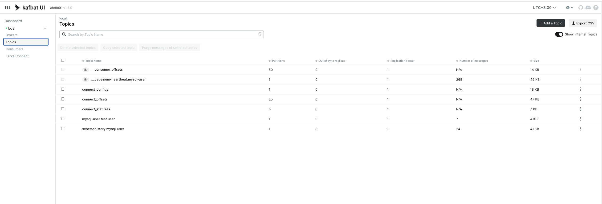
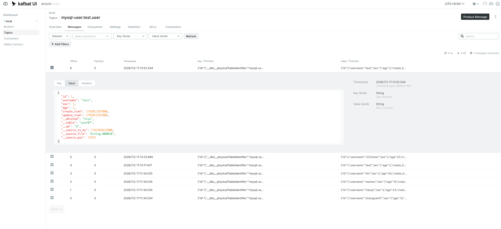
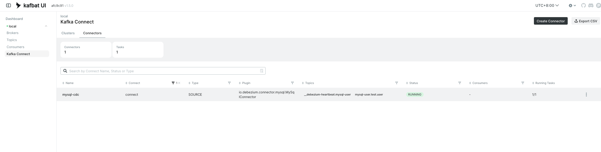
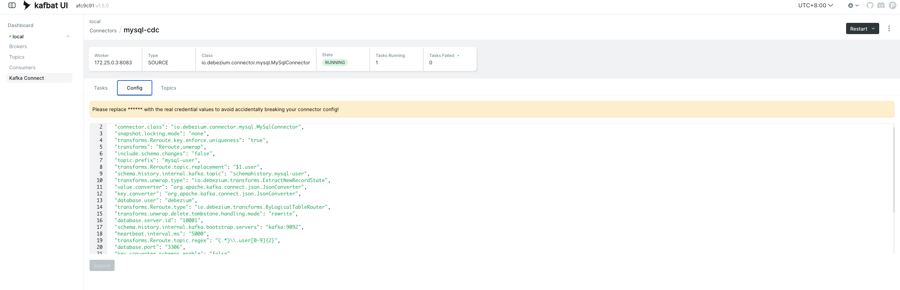

# MySQL CDC 到 StarRocks 实战手册

目标：基于当前仓库现有配置，稳定跑通 MySQL -> Debezium -> Kafka -> StarRocks，并保证删除事件生效、全量晚到不覆盖增量新值。









## 1. 先看项目里的真源配置

以下文件是当前项目可直接执行的配置真源：

- Connector 配置: configs/kafka-connect/mysql-connect.json
- StarRocks 建表: configs/start_rocks/user.sql
- StarRocks Routine Load: configs/start_rocks/cdc_user_routine_load.sql
- Kafka 与 Connect 编排: docker/kafka/docker-compose.yaml
- StarRocks 编排: docker/starrocks/docker-compose.yaml

文档示例与上述文件保持一致，若你后续改了配置文件，请以配置文件为准。

## 2. 当前链路关键约束

1. Debezium 输出扁平 JSON

- 已配置 value.converter.schemas.enable=false
- Routine Load 的 jsonpaths 使用 $.id 这种顶层路径，而不是 $.payload.id

2. 分表合并到一个逻辑 Topic

- 监听正则: test.user[0-9]{2}
- 合并目标 Topic: mysql-user.test.user

3. 删除事件通过 \_\_op 映射到 StarRocks 删除语义

- Debezium 输出 \_\_op=d
- Routine Load 映射为 \_\_op=1

4. 使用 sequence 列避免旧数据覆盖新数据

- 表属性: function_column.sequence_col = \_\_source_ts_ms

## 3. 启动基础组件

先启动 Kafka、Connect、Kafka UI：

```bash
cd docker/kafka
docker compose up -d
docker ps
```

再启动 StarRocks：

```bash
cd docker/starrocks
docker compose up -d
docker ps
```

访问地址：

- Kafka UI: http://localhost:1818
- StarRocks FE: http://localhost:8030

## 4. MySQL 前置检查

MySQL 必须满足：

- log_bin = ON
- binlog_format = ROW
- binlog_row_image = FULL

检查命令：

```sql
SHOW VARIABLES LIKE 'log_bin';
SHOW VARIABLES LIKE 'binlog_format';
SHOW VARIABLES LIKE 'binlog_row_image';
```

如果 MySQL 在宿主机、Debezium 在容器内，Connector 里要使用 host.docker.internal。

## 5. 准备测试库与分表

示例：

```sql
CREATE DATABASE IF NOT EXISTS test;
USE test;

CREATE TABLE user00 (
    id BIGINT UNSIGNED NOT NULL AUTO_INCREMENT,
    username VARCHAR(20) DEFAULT '',
    sex TINYINT UNSIGNED,
    age INT UNSIGNED,
    create_time DATETIME DEFAULT CURRENT_TIMESTAMP,
    update_time DATETIME DEFAULT CURRENT_TIMESTAMP ON UPDATE CURRENT_TIMESTAMP,
    PRIMARY KEY(id)
);
```

再按同结构创建 user01 到 user09。

## 6. 创建 Debezium Connector

推荐直接使用 configs/kafka-connect/mysql-connect.json。

通过 REST 创建示例：

```bash
curl -sS -X POST http://localhost:8083/connectors \
    -H 'Content-Type: application/json' \
    -d @configs/kafka-connect/mysql-connect.json
```

查看状态：

```bash
curl -sS http://localhost:8083/connectors
curl -sS http://localhost:8083/connectors/mysql-user/status
```

若你是更新现有 Connector，建议：

1. 先暂停消费端任务
2. 更新 Connector 配置
3. 再恢复消费端

## 7. 在 StarRocks 建表并创建 Routine Load

连接 StarRocks：

```bash
mysql -h127.0.0.1 -P9030 -uroot
```

执行：

```sql
CREATE DATABASE IF NOT EXISTS cdc_demo;
USE cdc_demo;
SOURCE /path/to/mysql-cdc-wiki/configs/start_rocks/user.sql;
SOURCE /path/to/mysql-cdc-wiki/configs/start_rocks/cdc_user_routine_load.sql;
```

提示：当前例子中的 Routine Load 名称是 cdc_demo.user_cdc_load，请保持数据库名与脚本一致。

检查状态：

```sql
SHOW ROUTINE LOAD;
SHOW ROUTINE LOAD FOR user_cdc_load;
SHOW ROUTINE LOAD TASK;
```

## 8. 端到端验证

在 MySQL：

```sql
INSERT INTO test.user00(username, sex, age) VALUES ('Tom', 1, 18);
UPDATE test.user00 SET age = 20 WHERE id = 1;
DELETE FROM test.user00 WHERE id = 1;
```

在 StarRocks：

```sql
SELECT * FROM cdc_demo.user WHERE __table = 'user00' AND id = 1;
```

预期：

- 插入后可查到
- 更新后值变化
- 删除后查询为空

## 9. 常见问题与修复

1. jsonpaths 语法报错 Unexpected input '$'

- 原因：双引号没有转义
- 正确格式示例：
  "jsonpaths" = "[\"$.id\",\"$.username\"]"

2. Kafka 消息里看到 payload，但 Routine Load 用的是 $.id

- 原因：消息结构与路径不匹配
- 先确认 Connector 是否已生效为 schemas.enable=false
- 若仍是 envelope，则路径应改为 $.payload.id

3. 删除事件没有生效

- 检查 Debezium 是否输出 \_\_op=d
- 检查 Routine Load 是否映射 **op = if(**op_raw='d', 1, 0)
- 检查目标表是否为 Primary Key 表

4. 全量晚到覆盖增量新值

- 检查 function_column.sequence_col 是否为 \_\_source_ts_ms
- 检查导入时 \_\_source_ts_ms 是否非空且正确赋值

## 10. 生产建议

1. 热表走实时 CDC，冷表按月批导
2. 批导与实时并行时，统一用版本列做胜出规则
3. 每批导入后做三类校验：行数、主键抽样、关键聚合指标
4. 保证 binlog 保留时间覆盖快照和追平窗口

以上流程可作为当前项目的基线手册，后续新增分表时，仅需保证命名匹配和结构一致即可接入。
